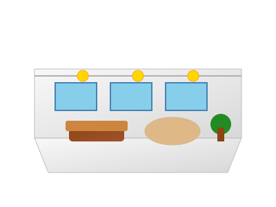
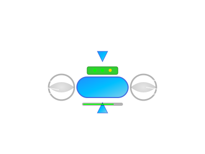

<!DOCTYPE html>
<html lang="en">
<head>
    <meta charset="UTF-8">
    <meta name="viewport" content="width=device-width, initial-scale=1.0">
    <meta name="description" content="Innovative floating home solutions for modern living">
    <meta name="author" content="Hannes Mitterer">

    <!-- Open Graph / Facebook -->
    <meta property="og:type" content="website">
    <meta property="og:url" content="https://hannesmitterer.github.io/zeppelin-home/">
    <meta property="og:title" content="Zeppelin Home - Revolutionary Floating Living Solutions">
    <meta property="og:description" content="Innovative floating home solutions for modern living">
    <meta property="og:image" content="https://hannesmitterer.github.io/zeppelin-home/assets/images/zeppelin-hero-integrated.svg">

    <!-- Twitter -->
    <meta property="twitter:card" content="summary_large_image">
    <meta property="twitter:url" content="https://hannesmitterer.github.io/zeppelin-home/">
    <meta property="twitter:title" content="Zeppelin Home - Revolutionary Floating Living Solutions">
    <meta property="twitter:description" content="Innovative floating home solutions for modern living">
    <meta property="twitter:image" content="https://hannesmitterer.github.io/zeppelin-home/assets/images/zeppelin-hero-integrated.svg">

    <title>Zeppelin Home - Revolutionary Floating Living Solutions</title>
    
    <!-- Favicon -->
    <link rel="icon" type="image/svg+xml" href="assets/images/zeppelin-hero-integrated.svg">
    
    <!-- CSS -->
    <link rel="stylesheet" href="assets/css/main.css">
    
    <!-- Fonts -->
    <link rel="preconnect" href="https://fonts.googleapis.com">
    <link rel="preconnect" href="https://fonts.gstatic.com" crossorigin>
    
    <!-- SEO Plugin -->
    <!-- Begin Jekyll SEO tag v2.8.0 -->
    <meta name="generator" content="Jekyll v3.10.0" />
    <meta property="og:locale" content="en_US" />
    <link rel="canonical" href="https://hannesmitterer.github.io/zeppelin-home/" />
    <meta property="og:site_name" content="Zeppelin Home" />
    
    <!-- End Jekyll SEO tag -->
</head>
<body>
    <main>
        <section class="hero">
            

                <h1>ZEPPELIN HOME</h1>
                
The Future of Floating Living

                
                

                    Explore four Zeppelin models, each in signature olive green matte: luxury or low cost versions for cold or warm climates. Smart design, comfort, and efficiency—tailored for every lifestyle and environment.
                

                

                    <h2>View CAD Renderings</h2>
                    <ul>
                        <li>
                            <a href="assets/cad/cold-climate-luxury-cad.png" target="_blank" rel="noopener">
                                Cold Climate Luxury Model
                            </a>
                        </li>
                        <li>
                            <a href="assets/cad/cold-climate-lowcost-cad.png" target="_blank" rel="noopener">
                                Cold Climate Low Cost Model
                            </a>
                        </li>
                        <li>
                            <a href="assets/cad/warm-climate-luxury-cad.png" target="_blank" rel="noopener">
                                Warm Climate Luxury Model
                            </a>
                        </li>
                        <li>
                            <a href="assets/cad/warm-climate-lowcost-cad.png" target="_blank" rel="noopener">
                                Warm Climate Low Cost Model
                            </a>
                        </li>
                    </ul>
                

            

        </section>

        <section class="features">
            

                

                    <h2>Revolutionary Living Experience</h2>
                    
Discover how Zeppelin Home transforms the concept of modern living through innovative floating architecture and sustainable design.

                

                
                

                    

                        
                        <h3>Luxury Interior Design</h3>
                        
Step into a world of refined elegance with our carefully curated interiors. Each Zeppelin Home features premium materials, panoramic windows with 360° views, and smart home technology that adapts to your lifestyle. Experience living spaces that float effortlessly above the world while maintaining the highest standards of comfort and sophistication.

                    

                    
                    

                        
                        <h3>Advanced Propulsion System</h3>
                        
Our state-of-the-art electric propulsion technology ensures whisper-quiet operation and zero-emission travel. With GPS-guided auto-pilot, weather adaptation systems, and renewable energy integration, your Zeppelin Home moves intelligently and sustainably through the sky, making every journey an adventure in luxury.

                    

                    
                    

                        
                        <h3>Ultimate Mobility &amp; Freedom</h3>
                        
Break free from traditional real estate constraints. Your Zeppelin Home adapts to any climate and location, from urban skylines to remote natural wonders. With cross-platform compatibility for various landing systems and international airspace integration, the world truly becomes your neighborhood.

                    

                

            

        </section>

        <section class="cta">
            

                <h2>Ready to Elevate Your Living?</h2>
                
Join the revolution in modern living. Experience the freedom, luxury, and innovation that only Zeppelin Home can provide.

                <a href="#contact" class="btn">Learn More</a>
            

        </section>

        <footer class="footer" id="contact">
            

                
&copy; 2024 Zeppelin Home. Elevating the future of residential living.

                
Contact us to schedule your exclusive preview flight.

            

        </footer>
    </main>
    
    <!-- Optional JavaScript for enhanced interactions -->
    
    <!-- Analytics placeholder -->
    <!-- Add your analytics code here -->
</body>
</html>
