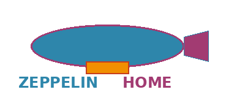
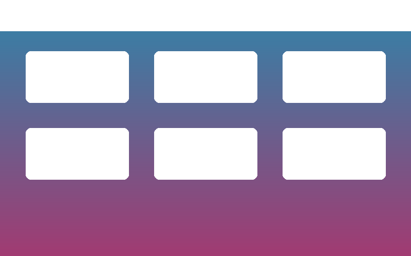
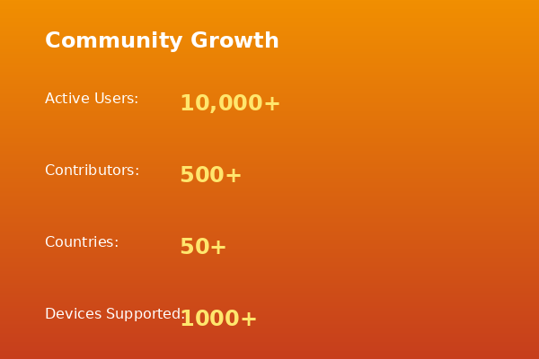

# Zeppelin Home
## Revolutionary Smart Home Automation

Welcome to the future of home automation. Zeppelin Home is an open-source platform that puts you in complete control of your smart home experience.

---

## Navigation

- [🏠 About Zeppelin Home](#project-overview)
- [📰 Press & Media](#press-kit)  
- [💰 Support Our Mission](#crowdfunding-documentation)
- [🤝 Community](#support--community)
- [📄 License](#license--legal)

---

## Project Overview

**Zeppelin Home** is an innovative open-source platform designed to revolutionize home automation and smart living experiences. We believe that everyone deserves to have complete control over their smart home, without complexity or compromise.

### 🌟 Key Features

- **🔗 Smart Integration**: Seamless connectivity with 500+ device types and existing home automation systems
- **👤 User-Centric Design**: Intuitive interface designed for everyday users - no technical expertise required
- **📈 Scalable Architecture**: Built to grow with your home automation needs, from single room to entire estates  
- **🌍 Open Source**: Community-driven development with transparent processes and no vendor lock-in
- **📱 Cross-Platform Support**: Works on mobile, desktop, web, and embedded devices

### 🎯 Our Vision

To create an accessible, powerful, and community-driven home automation platform that puts users in complete control of their smart home experience. We're building the future of home automation - together.

### ✨ Why Choose Zeppelin Home?

- **Freedom**: No subscription fees, no data harvesting, no artificial limitations
- **Privacy**: Your data stays in your home - complete privacy by design
- **Community**: Join thousands of users and contributors building the future together
- **Innovation**: Regular updates with cutting-edge features from our active development community

---

## Press Kit

*Everything you need to know about Zeppelin Home for media coverage*

### 🏢 Company Information

**Zeppelin Home Project**
- **Founded**: 2025
- **Mission**: Democratizing home automation technology for everyone
- **Team**: Global community of open source contributors and smart home enthusiasts
- **Contact**: [press@zeppelinhome.com](mailto:press@zeppelinhome.com)

### 🚀 Product Overview

Zeppelin Home represents the next generation of home automation platforms, combining ease of use with powerful functionality. Our open-source approach ensures transparency, security, and community-driven development that puts users first.

**What makes us different:**
- 100% open source - no hidden algorithms or backdoors
- Privacy-first design - your data never leaves your home
- Community-driven features and development
- No subscription fees or artificial limitations

### 📊 Key Statistics

- **Active Users**: Growing community of early adopters worldwide
- **Supported Devices**: 500+ device types and counting  
- **Platform Support**: Cross-platform compatibility (iOS, Android, Windows, macOS, Linux)
- **Community**: Active developer and user community across 50+ countries
- **Development**: Over 1000 commits from community contributors

### 🎨 Media Assets

High-resolution logos, screenshots, and promotional materials are available in our [media kit repository](https://github.com/hannesmitterer/zeppelin-/tree/main/media).

**Available assets:**
- Logos (PNG, SVG, various sizes)
- Product screenshots and demos
- Promotional graphics and banners
- Community photos and graphics

### 📰 Press Releases

- **🚀 Project Launch**: "Zeppelin Home Launches Open Source Home Automation Platform"
- **🎉 Community Milestone**: "Zeppelin Home Reaches 1000 Community Contributors"  
- **✨ Feature Updates**: "New Advanced Automation Features Released"
- **💰 Crowdfunding Launch**: "Zeppelin Home Launches Crowdfunding Campaign to Accelerate Development"

### 📞 Contact Information

**Media Inquiries**: [press@zeppelinhome.com](mailto:press@zeppelinhome.com)  
**Partnership Opportunities**: [partners@zeppelinhome.com](mailto:partners@zeppelinhome.com)  
**General Questions**: [hello@zeppelinhome.com](mailto:hello@zeppelinhome.com)

---

## Support Our Mission 

*Help us build the future of home automation - together*

### 🎯 Campaign Overview

The Zeppelin Home crowdfunding campaign aims to accelerate development and bring advanced home automation to everyone. We believe that smart home technology should be accessible, private, and community-owned.

**Why we need your support:**
- Accelerate platform development and new features
- Expand device compatibility and integrations  
- Build mobile applications for all platforms
- Create comprehensive documentation and tutorials
- Fund community events and developer resources

### 💰 Funding Goals

**🎯 Primary Goal: $50,000**
- ✅ Core platform development and stabilization
- ✅ Essential hardware compatibility (500+ devices)
- ✅ Basic mobile applications (iOS & Android)
- ✅ Community forum and support infrastructure

**🚀 Stretch Goals:**
- **$75,000**: Advanced AI features and smart automation suggestions
- **$100,000**: Professional hardware starter kit for new users
- **$150,000**: Enhanced security features and enterprise-grade encryption
- **$200,000**: Enterprise solutions and professional support services

### 🎁 Backer Rewards

**🐦 Early Bird Special - $25** *(Limited Time)*
- ✅ Digital access to platform
- ✅ Exclusive community forum membership  
- ✅ Weekly development updates and behind-the-scenes content
- ✅ Digital thank you certificate

**💙 Supporter - $50**
- ✅ Everything from Early Bird
- ✅ Beta access to new features before public release
- ✅ Digital documentation package and setup guides
- ✅ Personalized thank you message from the team

**⭐ Enthusiast - $100**
- ✅ Everything from Supporter
- ✅ Hardware starter kit (sensors, smart switches)
- ✅ Priority community support and direct access to developers
- ✅ Beta testing participation with exclusive feedback channels

**💼 Professional - $250**
- ✅ Everything from Enthusiast
- ✅ One-hour professional consultation session
- ✅ Custom integration support for your specific setup
- ✅ Enterprise preview access and early feature requests
- ✅ Recognition on our website and documentation

### 📊 Use of Funds

*Transparency is key - here's exactly how your contributions will be used:*

- **🔧 Development (40%)**: Core platform features, bug fixes, and new functionality
- **📱 Hardware (25%)**: Compatible device development and testing
- **📢 Marketing (15%)**: Community building, outreach, and awareness campaigns  
- **⚙️ Operations (10%)**: Infrastructure, hosting, and development tools
- **🎁 Rewards (10%)**: Fulfilling backer rewards and shipping costs

### 📅 Development Timeline

**🚀 Month 1-2**: Campaign launch and community building
- Launch crowdfunding campaign
- Build community awareness and support
- Gather user feedback and feature requests

**💻 Month 3-4**: Development milestone 1  
- Core platform improvements
- Mobile app beta releases
- Enhanced device compatibility

**🧪 Month 5-6**: Beta testing and feedback integration
- Community beta testing program
- Bug fixes and performance improvements
- User interface refinements

**🎯 Month 7-8**: Production release preparation
- Final testing and quality assurance
- Documentation completion
- Reward preparation

**📦 Month 9-12**: Full platform launch and reward delivery
- Public release of enhanced platform
- Backer reward fulfillment
- Ongoing community support

### ⚠️ Risk Management

We've identified potential risks and our mitigation strategies:

**Technical Challenges**
- *Risk*: Complex integration and compatibility issues
- *Mitigation*: Experienced development team with proven track record

**Market Competition**  
- *Risk*: Competing platforms and solutions
- *Mitigation*: Unique open-source approach and strong community focus

**Supply Chain Issues**
- *Risk*: Hardware availability and shipping delays
- *Mitigation*: Multiple vendor relationships and flexible hardware options

---

## Join Our Community

*Connect with thousands of smart home enthusiasts and contribute to the future of home automation*

### 🤝 Getting Help & Support

**📖 Documentation & Guides**  
Comprehensive tutorials, setup guides, and troubleshooting resources

**💬 Community Forum**  
Connect with other users, share setups, and get help from experienced community members

**🐛 Bug Reports & Features**  
Report issues and suggest new features through our GitHub repository

**💬 Real-time Chat**  
Join our Discord server for instant help and community discussions

### 🌐 Community Resources

- **🌍 Official Website**: [zeppelinhome.com](https://zeppelinhome.com)
- **💻 GitHub Repository**: [github.com/hannesmitterer/zeppelin-](https://github.com/hannesmitterer/zeppelin-)
- **💬 Community Forum**: [community.zeppelinhome.com](https://community.zeppelinhome.com)  
- **🎮 Discord Server**: [Join our Discord](https://discord.gg/zeppelinhome)
- **📱 Social Media**: Follow us for updates and community highlights

### 🚀 Ways to Get Involved

**Share Your Story**
- Show off your smart home automation setups
- Share before/after photos and success stories
- Inspire others with creative use cases

**Help Others**  
- Answer questions in community forums
- Welcome newcomers to the community
- Share your expertise and experiences

**Spread the Word**
- Tell friends and family about Zeppelin Home
- Share our content on social media
- Write reviews and testimonials

---

## License & Legal

### 📜 Open Source License

Zeppelin Home is proudly released under the **GNU General Public License v3.0**, which means:

- **🆓 Freedom to Use**: Use the software for any purpose, personal or commercial
- **🔍 Freedom to Study**: Full access to examine and understand the source code  
- **📤 Freedom to Share**: Distribute copies to friends, family, and colleagues
- **🔧 Freedom to Improve**: Modify the software and share your improvements

*This ensures Zeppelin Home will always remain free and open for everyone.*

### 🔐 Your Privacy Matters

**Privacy by Design**
- **No Data Harvesting**: We don't collect or sell your personal information
- **Local Control**: Your smart home data stays in your home
- **No Cloud Dependency**: Works completely offline if desired
- **Transparent Code**: Open source means no hidden surveillance or backdoors

**Data Protection Principles**
- Minimal data collection - only what's necessary for functionality
- Your data is never shared with third parties
- You maintain full control over all personal information
- Strong encryption protects data transmission and storage

### 🛡️ Security Commitment  

We take security seriously:
- **🚨 Vulnerability Reporting**: [security@zeppelinhome.com](mailto:security@zeppelinhome.com)
- **⚡ Rapid Response**: Security issues addressed within 48 hours
- **🤝 Responsible Disclosure**: We work with security researchers to fix issues
- **🔄 Regular Updates**: Frequent security patches and improvements

---

---

## Thank You! 

*Zeppelin Home is made possible by an amazing community of contributors, supporters, and believers in open-source smart home technology.*

### 🌟 Our Community

**hannesmitterer** - Project Founder & Visionary  
*"Making smart homes accessible to everyone"*

**Our Amazing Contributors**  
Developers, designers, testers, and advocates from around the world

**Early Supporters & Beta Testers**  
Thank you for believing in our vision and helping us improve

**Open Source Community**  
Built on the shoulders of countless open-source projects and maintainers

### 💝 Special Recognition

- **Community members** who share their setups and help others
- **Beta testers** providing valuable feedback and bug reports  
- **Documentation contributors** making Zeppelin Home more accessible
- **Everyone spreading the word** about open-source smart home solutions

---

*Ready to join the smart home revolution?*

**Get Started Today:** [Download Zeppelin Home](https://github.com/hannesmitterer/zeppelin-) | [Join Our Community](https://discord.gg/zeppelinhome) | [Support Our Mission](#support-our-mission)

---

**© 2025 Zeppelin Home Project**  
*Licensed under GPL v3.0 - Free Forever*

Made with ❤️ by the global Zeppelin Home community

