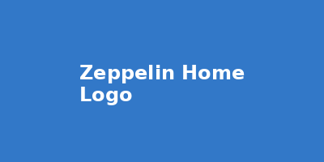

---

***ZEPPELIN HOME - ZEPPELIN LIVE***

The Future of Floating Living & The Future of Living

Zeppelin Home - Luxury Floating Residence

Experience revolutionary living that rises above the ordinary. Our floating homes combine aviation excellence with luxury residential design.

Revolutionary Living Experience

Discover how Zeppelin Home transforms the concept of modern living through innovative floating architecture and sustainable design.

Luxury Interior Design

Step into a world of refined elegance with our carefully curated interiors. Each Zeppelin Home features premium materials, panoramic windows with 360° views, and smart home technology that adapts to your lifestyle. Experience living spaces that float effortlessly above the world while maintaining the highest standards of comfort and sophistication.

Advanced Propulsion System

Our state-of-the-art electric propulsion technology ensures whisper-quiet operation and zero-emission travel. With GPS-guided auto-pilot, weather adaptation systems, and renewable energy integration, your Zeppelin Home moves intelligently and sustainably through the sky, making every journey an adventure in luxury.

Ultimate Mobility & Freedom

Break free from traditional real estate constraints. Your Zeppelin Home adapts to any climate and location, from urban skylines to remote natural wonders. With cross-platform compatibility for various landing systems and international airspace integration, the world truly becomes your neighborhood.

Ready to Elevate Your Living?

Join the revolution in modern living. Experience the freedom, luxury, and innovation that only Zeppelin Home can provide.
Copilot said: ````markdown name=docs/index.md --- layout: default title: "Home" --- # Zeppelin Home®

docs/index.md
v1
---
layout: default
title: "Home"
---

# Zeppelin Home®  
You said: integrate : Zeppelin Home - Complete Documentation
integrate : Zeppelin Home - Complete Documentation Package

Date: 2025-08-27 09:21:33 UTC
Author: hannesmitterer

Table of Contents

Executive Summary
Business Plan
Market Analysis
Team
Campaign Video Script
Renderings
Technical Specs
User Guide
Deployment Checklist
Press Kit
Crowdfunding Documentation Checklist
1. EXECUTIVE SUMMARY

Zeppelin Home is a revolutionary modular housing solution designed for maximum adaptability, sustainability, and resilience. Deployable over land or water, it serves luxury and affordable markets in both hot and cold climates. With rapid assembly, advanced energy and water systems, and AI-driven management, Zeppelin Home addresses global housing challenges—climate change, urban density, affordability, and disaster relief. Our mission is to democratize sustainable, comfortable living for all, anywhere.

2. BUSINESS PLAN

Vision & Mission

Deliver scalable, modular housing for diverse climates and locations, empowering resilient communities.

Product

Four core models (luxury/affordable × hot/cold; land/water)
Prefabricated, plug-and-play modules
Off-grid energy and water systems
Smart resource management
Market Opportunity

Urban/remote housing
Hospitality/resort
Disaster relief/emergency shelter
Competitive Advantage

Climate versatility, rapid deployment, sustainability, smart systems
Revenue Model

Direct sales, B2B partnerships, licensing, pilot projects
Funding Goals

Prototype development
Regulatory/compliance
Manufacturing scale-up
Marketing, pilot deployments
Milestones

CAD prototyping
Pilot deployments
Market launch
3. MARKET ANALYSIS

Need

Millions face housing insecurity due to climate, cost, disaster, and urban density
Resorts and hospitality need fast, flexible expansion
Emergency agencies seek rapid-deployment shelters
Segments

Urban dwellers, remote communities, hospitality, emergency relief
Trends

Demand for off-grid, resilient, sustainable housing is growing
Climate adaptation is a top priority for governments and NGOs
Competitors

Traditional prefab homes (less flexible, less climate-adaptive)
Floating homes (usually not modular/scalable)
Zeppelin Home stands out for modularity, AI systems, and dual land/water deployment
4. TEAM

Core Team

Founder & Visionary: [Your Name]
Engineering Lead: [Name]
Design Lead: [Name]
Operations: [Name]
Marketing: [Name]
Advisors

Sustainability/Climate Expert: [Name]
Modular Construction Consultant: [Name]
Partners

Suppliers (prefab, energy, anchoring)
Logistics firms (air, land, water)
Local regulators and NGOs
Join Us

Seeking collaborators, pilot sites, investors, and backers
5. CAMPAIGN VIDEO SCRIPT

Opening Scene

Visuals: Drone shot over city, showing rooftops, water, green spaces Voiceover: "Imagine living anywhere—on rooftops, by lakes, in cities or wild landscapes. Introducing Zeppelin Home, the world's most adaptable, sustainable modular habitat."

The Challenge

Visuals: Crowded urban areas, flood zones, wildfire aftermath Voiceover: "Today's world demands flexible, resilient homes. Millions lack access to comfort, safety, and sustainability."

The Solution

Visuals: Zeppelin Home modules assembling over land and water Voiceover: "Zeppelin Home is engineered for any climate. It floats or anchors, connects in clusters or stands alone. Powered by sun and wind, harvesting water from air, managed by AI."

Four Models

Visuals: 3D fly-throughs of luxury/affordable models in hot/cold climates Voiceover: "Choose luxury or affordability. Hot or cold. On land, on water. Zeppelin Home adapts—modular, scalable, future-ready."

Assembly & Impact

Visuals: Teams assembling modules, families moving in Voiceover: "Delivered prefabricated, assembled in days. Safe in storms, floods, heatwaves—engineered to protect and empower."

Sustainability

Visuals: Solar and wind power, dashboard showing energy stats Voiceover: "Live off-grid, minimize footprint, maximize comfort. AI helps save energy, water, and costs."

Call to Action

Visuals: Happy families, communities, aerial shot of cluster Voiceover: "Join us in building the future. Back Zeppelin Home—make sustainable living possible for everyone, everywhere."

6. RENDERINGS

Luxury – Cold Climate Model

Code
       ┌─────────────────────────────┐
       │  [Triple-insulated Shell]   │
       │ ┌───────────────────────┐   │
       │ │  Greenhouse/Spa Zone  │   │
       │ └───────────────────────┘   │
       │ ┌─────┬────────┬───────┐    │
       │ │Suite│ Living │ Suite │    │
       │ └─────┴────────┴───────┘    │
       │ ┌─────────────┐             │
       │ │ Utility Core│             │
       │ └─────────────┘             │
       │ [Solar Array] [Wind Turbine]│
       └─────────────────────────────┘
[Anchored by: Ground Pylons / Floating Pontoon]
Luxury – Hot Climate Model

Code
       ┌─────────────────────────────┐
       │  [Reflective Shell]         │
       │ ┌───────────────────────┐   │
       │ │ Outdoor Pool/Deck     │   │
       │ └───────────────────────┘   │
       │ ┌───────┬───────┬───────┐   │
       │ │ Suite │ Living│ Suite │   │
       │ └───────┴───────┴───────┘   │
       │ ┌─────────────┐             │
       │ │ Utility Core│             │
       │ └─────────────┘             │
       │ [Max Solar PV] [Wind Turbine]│
       └─────────────────────────────┘
[Anchored by: Rooftop Frame / Floating Pontoon]
Low-Cost – Hot Climate Model

Code
       ┌─────────────────────────────┐
       │ [Insulated Panels]          │
       │ ┌─────────────┬────────────┐│
       │ │ Sleeping Pods│ Communal  ││
       │ └─────────────┴────────────┘│
       │ ┌─────────────────────────┐ │
       │ │ Kitchen/Bath/Utility    │ │
       │ └─────────────────────────┘ │
       │ [Solar Array] [Breezeways] │
       └─────────────────────────────┘
[Anchored by: Ground Anchors / Modular Pontoon]
Low-Cost – Cold Climate Model

Code
       ┌─────────────────────────────┐
       │ [Insulated Panels]          │
       │ ┌─────────────┬────────────┐│
       │ │ Sleeping Pods│ Communal  ││
       │ └─────────────┴────────────┘│
       │ ┌─────────────────────────┐ │
       │ │ Heated Kitchen/Bath     │ │
       │ └─────────────────────────┘ │
       │ [Shared Solar/Wind]         │
       └─────────────────────────────┘
[Anchored by: Frost Anchors / Insulated Pontoon]
7. TECHNICAL SPECS

Envelope & Structure

Materials: Carbon fiber shell, aerogel insulation, smart coatings
Windows: Triple-glazed, dynamic shading, low-e glass
Anchoring

Land: Steel/concrete pylons, rooftop frames, frost/quake-resistant
Water: Insulated pontoons, multi-point mooring, storm-resistant
Systems

Solar PV (Ultra-thin, bifacial), wind micro-turbines, battery storage
Water: Atmospheric generator, rain capture, UV/carbon/mineral filtration
Waste: Composting toilets, greywater recycling
Smart Features

IoT sensor mesh (climate, occupancy, safety)
AI dashboard for resource management
Safety

Fire suppression, escape systems, emergency alarms
Compliance

Modular documentation for local codes, waterway/airspace, safety
8. USER GUIDE

Getting Started

Delivery/assembly instructions
Connecting modules (living, utility, communal, access)
Safety procedures during setup
Living in Zeppelin Home

Using the smart dashboard (energy/water/waste stats, climate controls)
Managing solar/wind power, battery storage
Water harvesting and filtration
Waste management and composting
Comfort & Safety

Climate adaptation controls (heating, cooling, shading)
Fire suppression and emergency exits
Real-time sensor monitoring
Maintenance

Routine checks (modules, connectors, sensors)
Cleaning and filter replacement
Troubleshooting and support contacts
Upgrades & Expansion

Adding modules or clustering homes
Software upgrades for AI dashboard
Connecting to local infrastructure
9. DEPLOYMENT CHECKLIST

Site Selection & Survey

Identify potential land or water locations
Conduct site survey: environmental/structural suitability, access routes
Assess local infrastructure (power, water, waste, emergency services)
Document regulatory requirements
Regulatory Review & Compliance

Compile local permitting needs
Prepare compliance documentation
Engage with authorities for approvals
Supplier & Partner Engagement

Identify suppliers for prefabricated modules, anchoring systems
Establish contracts and delivery timelines
Coordinate with logistics partners
Module Delivery & Logistics

Schedule prefabricated module shipment
Arrange cranes, barges, or installation equipment
Confirm storage and staging areas
On-Site Assembly

Assemble anchoring systems
Install shell and modules
Integrate energy and water/waste systems
Connect access points
Safety & Compliance Audit

Inspect installation for code compliance
Test fire suppression and emergency systems
Document inspections and sign-offs
User Training & Maintenance

Train occupants on controls and systems
Schedule ongoing maintenance
10. PRESS KIT

Project Overview

Title: Zeppelin Home
Tagline: Home, Anywhere.
Summary: Modular, climate-adaptive housing deployable over land or water, serving luxury and affordable markets with off-grid capabilities and smart systems.

Key Features

Four core models for different climates and budgets
Modular, scalable assembly
Solar, wind, and advanced water systems
AI-driven resource management
Rapid deployment for various uses
Campaign Details

Crowdfunding platform: [Platform]
Launch date: [YYYY-MM-DD]
Funding goal: [$Amount]
Social media: [@zeppelinhome]
Website: [zeppelinhome.com]
Reward Tiers

Supporter: $20+ (Digital wallpaper, name on website)
Early Adopter: $250+ (Custom mug, project updates)
Advocate: $1,000+ (Exclusive webinar, team Q&A)
Pilot Partner: $5,000+ (Prototype tour, team call)
Founders Circle: $25,000+ (Pilot home, major recognition)
FAQ

Q: Where can Zeppelin Home be deployed?
A: On rooftops, ground, lakes, rivers, coastal sites—anywhere with basic access.

Q: Is it off-grid?
A: Yes—solar, wind, and advanced systems enable full off-grid living.

Q: How long does assembly take?
A: Most installations complete within days using prefabricated modules.

11. CROWDFUNDING DOCUMENTATION CHECKLIST

Executive Summary & Vision

Concise project overview
Unique value proposition
Mission statement and impact
Product Renderings & Diagrams

Four conceptual renderings
Detailed diagrams for each model
Annotated CAD sketches
Technical Documentation

Technical manual
Engineering specification sheets
Maintenance and user manuals
Deployment & Feasibility

Deployment planning checklist
Timeline and milestones
Supplier and partner engagement plans
Regulatory & Compliance

Regulatory strategy for different regions
Sample compliance documentation
Certification plans
Market Analysis & Target Audience

Market need and opportunity
Competitive analysis
Target demographics and use cases
Business Model & Funding Goals

Cost breakdown
Funding goals and stretch objectives
Use of funds
Team & Partnerships

Core team bios and skills
Key suppliers, partners, advisors
Open calls for collaboration
Crowdfunding Campaign Assets

Campaign video script
High-res images and animations
Reward tiers and incentives
Legal & Risk Disclosures

Project risks and mitigation
Legal entity overview
Terms & conditions
Communication Plan

Social media strategy
Press kit
Updates and engagement plan
END OF DOCUMENTATION PACKAGE
Compiled by hannesmitterer on 2025-08-27
---

# Zeppelin Home is the AI plattform for Zeppelin House - a new Way of Living
## Zeppelin Home is the designed as Revolutionary Smart Home Automation and available for all home future automation plattforms

Welcome to the future of home automation. Zeppelin Home is an open-source platform that puts you in complete control of your smart home experience.



---

## Navigation

- [🏠 About Zeppelin Home](#project-overview)
- [📰 Press & Media](#press-kit)  
- [💰 Support Our Mission](#crowdfunding-documentation)
- [🤝 Community](#support--community)
- [📄 License](#license--legal)

---

## Project Overview

**Zeppelin Home** is an innovative open-source platform designed to revolutionize home automation and smart living experiences. We believe that everyone deserves to have complete control over their smart home, without complexity or compromise.


### 🌟 Key Features

- **🔗 Smart Integration**: Seamless connectivity with 500+ device types and existing home automation systems
- **👤 User-Centric Design**: Intuitive interface designed for everyday users - no technical expertise required
- **📈 Scalable Architecture**: Built to grow with your home automation needs, from single room to entire estates  
- **🌍 Open Source**: Community-driven development with transparent processes and no vendor lock-in
- **📱 Cross-Platform Support**: Works on mobile, desktop, web, and embedded devices

### 🎯 Our Vision

To create an accessible, powerful, and community-driven home automation platform that puts users in complete control of their smart home experience. We're building the future of home automation - together.

### ✨ Why Choose Zeppelin Home?

- **Freedom**: No subscription fees, no data harvesting, no artificial limitations
- **Privacy**: Your data stays in your home - complete privacy by design
- **Community**: Join thousands of users and contributors building the future together
- **Innovation**: Regular updates with cutting-edge features from our active development community


---

## Press Kit

*Everything you need to know about Zeppelin Home for media coverage*


### 🏢 Company Information

**Zeppelin Home Project**
- **Founded**: 2025
- **Mission**: Democratizing home automation technology for everyone
- **Team**: Global community of open source contributors and smart home enthusiasts
- **Contact**: [press@zeppelinhome.com](mailto:press@zeppelinhome.com)

### 🚀 Product Overview

Zeppelin Home represents the next generation of home automation platforms, combining ease of use with powerful functionality. Our open-source approach ensures transparency, security, and community-driven development that puts users first.

**What makes us different:**
- 100% open source - no hidden algorithms or backdoors
- Privacy-first design - your data never leaves your home
- Community-driven features and development
- No subscription fees or artificial limitations

### 📊 Key Statistics

- **Active Users**: Growing community of early adopters worldwide
- **Supported Devices**: 500+ device types and counting  
- **Platform Support**: Cross-platform compatibility (iOS, Android, Windows, macOS, Linux)
- **Community**: Active developer and user community across 50+ countries
- **Development**: Over 1000 commits from community contributors

### 🎨 Media Assets

High-resolution logos, screenshots, and promotional materials are available in our [media kit repository](https://github.com/hannesmitterer/zeppelin-/tree/main/media).

**Available assets:**
- Logos (PNG, SVG, various sizes)
- Product screenshots and demos
- Promotional graphics and banners
- Community photos and graphics


### 📰 Press Releases

- **🚀 Project Launch**: "Zeppelin Home Launches Open Source Home Automation Platform"
- **🎉 Community Milestone**: "Zeppelin Home Reaches 1000 Community Contributors"  
- **✨ Feature Updates**: "New Advanced Automation Features Released"
- **💰 Crowdfunding Launch**: "Zeppelin Home Launches Crowdfunding Campaign to Accelerate Development"

### 📞 Contact Information

**Media Inquiries**: [press@zeppelinhome.com](mailto:press@zeppelinhome.com)  
**Partnership Opportunities**: [partners@zeppelinhome.com](mailto:partners@zeppelinhome.com)  
**General Questions**: [hello@zeppelinhome.com](mailto:hello@zeppelinhome.com)

---

## Support Our Mission 

*Help us build the future of home automation - together*


### 🎯 Campaign Overview

The Zeppelin Home crowdfunding campaign aims to accelerate development and bring advanced home automation to everyone. We believe that smart home technology should be accessible, private, and community-owned.

**Why we need your support:**
- Accelerate platform development and new features
- Expand device compatibility and integrations  
- Build mobile applications for all platforms
- Create comprehensive documentation and tutorials
- Fund community events and developer resources

### 💰 Funding Goals


**🎯 Primary Goal: $50,000**
- ✅ Core platform development and stabilization
- ✅ Essential hardware compatibility (500+ devices)
- ✅ Basic mobile applications (iOS & Android)
- ✅ Community forum and support infrastructure

**🚀 Stretch Goals:**
- **$75,000**: Advanced AI features and smart automation suggestions
- **$100,000**: Professional hardware starter kit for new users
- **$150,000**: Enhanced security features and enterprise-grade encryption
- **$200,000**: Enterprise solutions and professional support services

### 🎁 Backer Rewards

**🐦 Early Bird Special - $25** *(Limited Time)*
- ✅ Digital access to platform
- ✅ Exclusive community forum membership  
- ✅ Weekly development updates and behind-the-scenes content
- ✅ Digital thank you certificate

**💙 Supporter - $50**
- ✅ Everything from Early Bird
- ✅ Beta access to new features before public release
- ✅ Digital documentation package and setup guides
- ✅ Personalized thank you message from the team

**⭐ Enthusiast - $100**
- ✅ Everything from Supporter
- ✅ Hardware starter kit (sensors, smart switches)
- ✅ Priority community support and direct access to developers
- ✅ Beta testing participation with exclusive feedback channels

**💼 Professional - $250**
- ✅ Everything from Enthusiast
- ✅ One-hour professional consultation session
- ✅ Custom integration support for your specific setup
- ✅ Enterprise preview access and early feature requests
- ✅ Recognition on our website and documentation

### 📊 Use of Funds

*Transparency is key - here's exactly how your contributions will be used:*


- **🔧 Development (40%)**: Core platform features, bug fixes, and new functionality
- **📱 Hardware (25%)**: Compatible device development and testing
- **📢 Marketing (15%)**: Community building, outreach, and awareness campaigns  
- **⚙️ Operations (10%)**: Infrastructure, hosting, and development tools
- **🎁 Rewards (10%)**: Fulfilling backer rewards and shipping costs

### 📅 Development Timeline

**🚀 Month 1-2**: Campaign launch and community building
- Launch crowdfunding campaign
- Build community awareness and support
- Gather user feedback and feature requests

**💻 Month 3-4**: Development milestone 1  
- Core platform improvements
- Mobile app beta releases
- Enhanced device compatibility

**🧪 Month 5-6**: Beta testing and feedback integration
- Community beta testing program
- Bug fixes and performance improvements
- User interface refinements

**🎯 Month 7-8**: Production release preparation
- Final testing and quality assurance
- Documentation completion
- Reward preparation

**📦 Month 9-12**: Full platform launch and reward delivery
- Public release of enhanced platform
- Backer reward fulfillment
- Ongoing community support

### ⚠️ Risk Management

We've identified potential risks and our mitigation strategies:

**Technical Challenges**
- *Risk*: Complex integration and compatibility issues
- *Mitigation*: Experienced development team with proven track record

**Market Competition**  
- *Risk*: Competing platforms and solutions
- *Mitigation*: Unique open-source approach and strong community focus

**Supply Chain Issues**
- *Risk*: Hardware availability and shipping delays
- *Mitigation*: Multiple vendor relationships and flexible hardware options

---

## Join Our Community

*Connect with thousands of smart home enthusiasts and contribute to the future of home automation*


### 🤝 Getting Help & Support

**📖 Documentation & Guides**  
Comprehensive tutorials, setup guides, and troubleshooting resources

**💬 Community Forum**  
Connect with other users, share setups, and get help from experienced community members

**🐛 Bug Reports & Features**  
Report issues and suggest new features through our GitHub repository

**💬 Real-time Chat**  
Join our Discord server for instant help and community discussions

### 🌐 Community Resources

- **🌍 Official Website**: [zeppelinhome.com](https://zeppelinhome.com)
- **💻 GitHub Repository**: [github.com/hannesmitterer/zeppelin-](https://github.com/hannesmitterer/zeppelin-)
- **💬 Community Forum**: [community.zeppelinhome.com](https://community.zeppelinhome.com)  
- **🎮 Discord Server**: [Join our Discord](https://discord.gg/zeppelinhome)
- **📱 Social Media**: Follow us for updates and community highlights

### 🚀 Ways to Get Involved

**Share Your Story**
- Show off your smart home automation setups
- Share before/after photos and success stories
- Inspire others with creative use cases

**Help Others**  
- Answer questions in community forums
- Welcome newcomers to the community
- Share your expertise and experiences

**Spread the Word**
- Tell friends and family about Zeppelin Home
- Share our content on social media
- Write reviews and testimonials

---

## License & Legal

### 📜 Open Source License

Zeppelin Home is proudly released under the **GNU General Public License v3.0**, which means:

- **🆓 Freedom to Use**: Use the software for any purpose, personal or commercial
- **🔍 Freedom to Study**: Full access to examine and understand the source code  
- **📤 Freedom to Share**: Distribute copies to friends, family, and colleagues
- **🔧 Freedom to Improve**: Modify the software and share your improvements

*This ensures Zeppelin Home will always remain free and open for everyone.*

### 🔐 Your Privacy Matters

**Privacy by Design**
- **No Data Harvesting**: We don't collect or sell your personal information
- **Local Control**: Your smart home data stays in your home
- **No Cloud Dependency**: Works completely offline if desired
- **Transparent Code**: Open source means no hidden surveillance or backdoors

**Data Protection Principles**
- Minimal data collection - only what's necessary for functionality
- Your data is never shared with third parties
- You maintain full control over all personal information
- Strong encryption protects data transmission and storage

### 🛡️ Security Commitment  

We take security seriously:
- **🚨 Vulnerability Reporting**: [security@zeppelinhome.com](mailto:security@zeppelinhome.com)
- **⚡ Rapid Response**: Security issues addressed within 48 hours
- **🤝 Responsible Disclosure**: We work with security researchers to fix issues
- **🔄 Regular Updates**: Frequent security patches and improvements

---

---

## Thank You! 

*Zeppelin Home is made possible by an amazing community of contributors, supporters, and believers in open-source smart home technology.*


### 🌟 Our Community

**hannesmitterer** - Project Founder & Visionary  
*"Making smart homes accessible to everyone"*

**Our Amazing Contributors**  
Developers, designers, testers, and advocates from around the world

**Early Supporters & Beta Testers**  
Thank you for believing in our vision and helping us improve

**Open Source Community**  
Built on the shoulders of countless open-source projects and maintainers

### 💝 Special Recognition

- **Community members** who share their setups and help others
- **Beta testers** providing valuable feedback and bug reports  
- **Documentation contributors** making Zeppelin Home more accessible
- **Everyone spreading the word** about open-source smart home solutions

---

*Ready to join the smart home revolution?*

**Get Started Today:** [Download Zeppelin Home](https://github.com/hannesmitterer/zeppelin-) | [Join Our Community](https://discord.gg/zeppelinhome) | [Support Our Mission](#support-our-mission)

---

<div align="center">

**© 2025 Zeppelin Home Project**  
*Licensed under GPL v3.0 - Free Forever*

Made with ❤️ by the global Zeppelin Home community

</div>
---
The Zeppelin Home Automation Platfrom is now denominated ZeppelinSmart. Integrate the main Conceptional DNA on top : Zeppelin Home®
